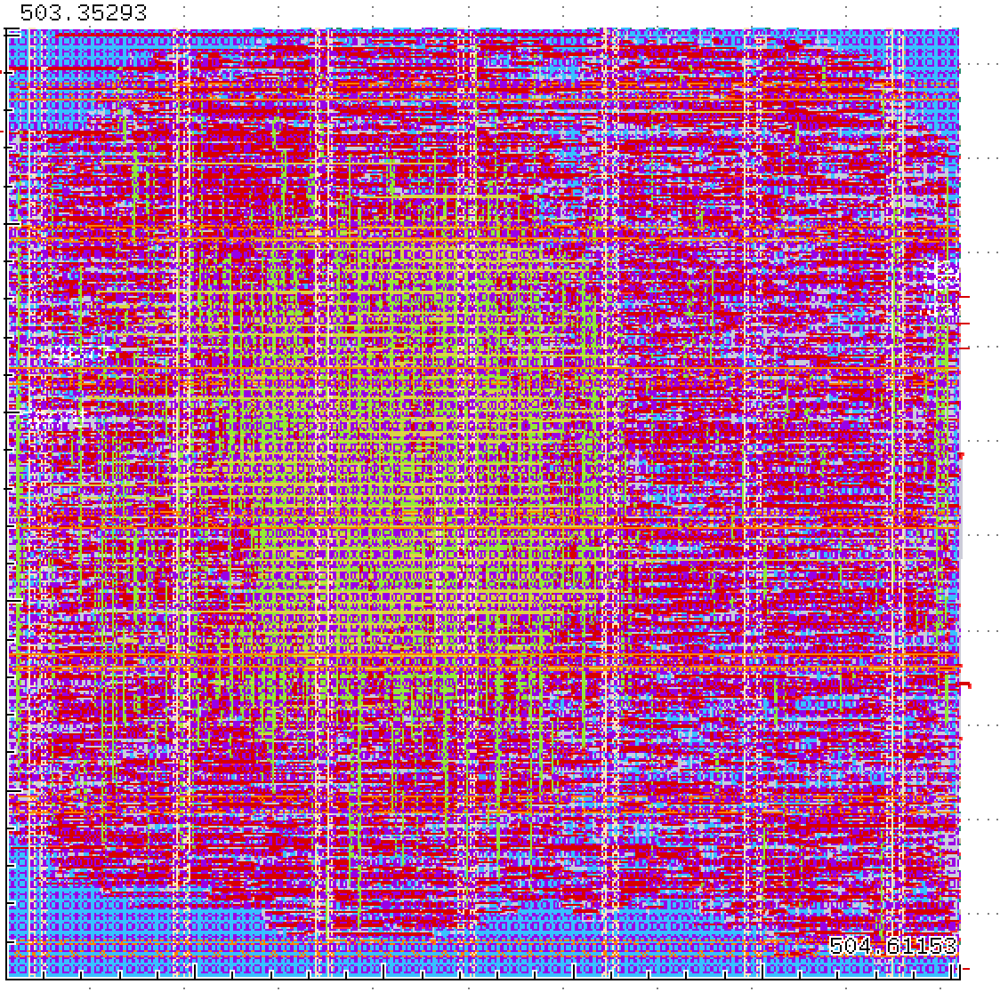

# CNN4IC
Convolutional Neural Network (CNN) for Image Classification

#### Created by:
- Jacobo Morales Erazo
- Mateo Fernandez Riveros
- Martín Calderón
- Hernando Diaz
- Daniel Pedraza

**Chapter/Section:** CASS Universidad de los Andes Student Chapter / Colombia Section

## Demos & Visualizations (Live via GitHub Pages)
Explore the project details and interactive simulations:
* [Interactive CNN Game](https://unic-cass-2025-uniandes.github.io/CNN4IC/html/cnn_game.html)
* [Architecture Diagram](https://unic-cass-2025-uniandes.github.io/CNN4IC/html/arch_diagram.html)
* [Dataset Cases](https://unic-cass-2025-uniandes.github.io/CNN4IC/html/dataset_casos.html)
* [CNN Architecture Details](https://unic-cass-2025-uniandes.github.io/CNN4IC/html/cnn_arch.html)

## Project Status & Implementation Metrics
**Last Update:** March 06, 2026

| Metric | Value |
| :--- | :--- |
| **Core Dimensions** | $\approx 503\ \mu m \times 504\ \mu m$ |
| **Die (Chip) Dimensions** | $\approx 515\ \mu m \times 534\ \mu m$ |
| **Logic Area** | $\approx 135,000\ \mu m^2$ |
| **Total Chip Area** | $\approx 0.27\ mm^2$ |

### Physical Layout & Dimensions

## Design Concept: Lightweight Binary Shape Classifier

This Integrated Circuit (IC) implements a specialized, resource-optimized Convolutional Neural Network (CNN) designed specifically for the low-power discrimination of geometric primitives (**crosses** and **plus signs**). 

### Architecture and Data Flow
The system processes **3-bit** grayscale images with **10 x 10** dimensions.

1. **Image Input:** Data is loaded via **SPI** into a pre-established set of registers.
2. **Convolution:** Processed by two concurrent kernels ($W_{+}$ and $W_x$). Quantized to signed integers to use simple **shift-and-add** logic instead of complex multipliers.
3. **Max Pooling:** Extracted from the $2\times2$ resulting matrix to identify prominent structural features.
4. **Classification:** Determined by a digital comparator:

$$\text{Class} = \begin{cases} 0 (+) & \text{if } \sum \text{Pool}_{+} > \sum \text{Pool}_{x} \\ 1 (\text{X}) & \text{otherwise} \end{cases}$$

### Hardware Optimization
The core innovation lies in **Strict Bit-Width Management**:
- **Weight Precision:** 3-bit registers for kernels.
- **Integer Domain:** Eliminates floating-point overhead.
- **Area Efficiency:** By streaming results externally, we significantly reduced the silicon footprint to the current $0.27\ mm^2$.

### Serial Interface (SPI)
A 4-wire protocol distinguishes between:
- **Weight Configuration:** In-field kernel updates for different patterns.
- **Image Data/Control:** Pixel transfer and inference cycle triggering.
