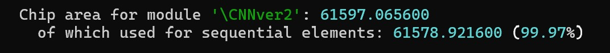
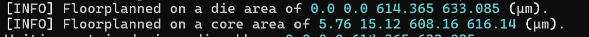

# CNN4IC
Convolutional Neural Network (CNN) for Image Classification

_Project still in development_

#### Created by:

- Jacobo Morales Erazo
- Mateo Fernandez Riveros
- Martín Calderón
- Hernando Diaz
- Daniel Pedraza

**Chapter/Section:** CASS Universidad de los Andes Student Chapter / Colombia Section

# Latest design files at CNNver2
### Project Status & Implementation Metrics - *updated 26/02/2026*

- **RTL Completion:** 90 % (refining small details with SPI communication)
    
- **Estimated Final Area:** 70000 $\mu m^2$
    
- **Actual Post-Synthesis Area:** 61598 $\mu m^2$ 
	- 614.4 $\mu m$  x 633.1 $\mu m$ 

---

### Description of the Design concept: Lightweight Binary Shape Classifier

This Integrated Circuit (IC) implements a specialized, resource-optimized Convolutional Neural Network (CNN) designed specifically for the low-power discrimination of geometric primitives (crosses and plus signs). By pivoting from generalized MNIST digit recognition (original idea) to a targeted binary classification task, the architecture achieves a significant reduction in gate count and memory requirements while maintaining high operational reliability.

#### Architecture and Data Flow

The system is **capable** of processing **3-bit** grayscale images with **8 x 8** dimensions.

1. **Image Input:** An image is saved into the chip via the Serial Peripheral Interface (SPI) protocol onto a **pre-established** set of registers.
    
2. **Convolution:** The image is processed by two concurrent kernels ($W_{+}$ and $W_x$). These kernels are quantized to signed integers, allowing the convolution to be performed using simple shift-and-add logic rather than complex floating-point multipliers.
    
3. **Max Pooling:** Each value of the $2\times2$ resulting matrix following the convolution is passed **through** a Max pooling layer to extract the most prominent structural features.
    
4. **Accumulation & Comparison:** The system calculates a "Structural Score" by summing the pooled feature maps. The final classification is determined by a simple digital comparator:
    

$$\text{Class} = \begin{cases} 0 (+) & \text{if } \sum \text{Pool}_{+} > \sum \text{Pool}_{x} \\ 1 (\text{X}) & \text{otherwise} \end{cases}$$

#### Hardware Optimization & Quantization Strategy

The core innovation of this design lies in its **Strict Bit-Width Management**. Unlike standard CNNs that propagate high-precision values, this IC enforces hardware-level quantization at every stage:

- **Weight Precision:** Kernels are stored in 3-bit registers.
    
- **Integer Domain:** All operations are performed in the integer domain.
    
- **Dynamic Range Control:** The results of the convolution operation are immediately **sent** outside the chip to be saved. In this way, **response times are yielded** to ensure a more optimal design in terms of **silicon area** used.
    

#### Serial Interface and Control

Communication is handled via a 4-wire **SPI (Serial Peripheral Interface)**. A simple addressing protocol distinguishes between:

- **Weight Configuration:** Allowing the kernels to be updated "in-field" for different geometric patterns.
    
- **Image Data/Control:** Facilitating the transfer of pixel data and triggering the inference cycle.